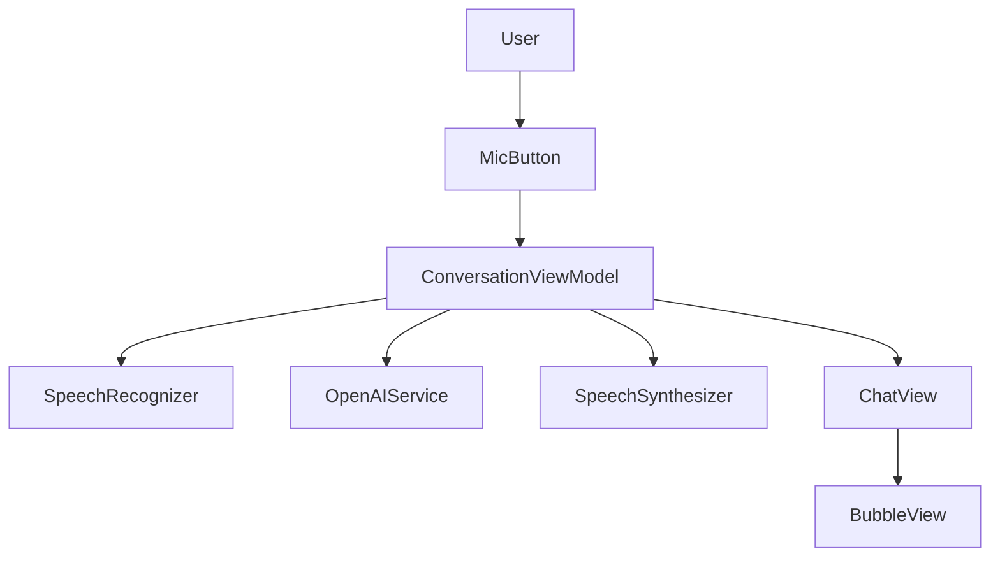

# Real-Time Conversational AI iOS App

This project implements a real-time voice chat with OpenAI using native iOS frameworks.

## Setup Instructions

1.  **Create a new Xcode Project**:
    *   Open Xcode.
    *   Create a new "App" project.
    *   Interface: SwiftUI.
    *   Language: Swift.

2.  **Add Source Files**:
    *   Copy the folders (`Models`, `Services`, `ViewModels`, `Views`) from this directory into your Xcode project.
    *   Ensure they are added to the App target.

3.  **Configure Permissions (`Info.plist`)**:
    *   Open your project's `Info.plist`.
    *   Add `Privacy - Microphone Usage Description`: "We need your microphone to hear your voice requests."
    *   Add `Privacy - Speech Recognition Usage Description`: "We use speech recognition to transcribe your voice."

4.  **Set API Key (do not hard-code)**:
    *   Copy `ConversationApp/Secrets.plist.example` to `ConversationApp/Secrets.plist`.
    *   Put your key into `OPENAI_API_KEY`.
    *   In Xcode, add `Secrets.plist` to the **ConversationApp** target (so it’s included in the app bundle).
    *   Never commit `Secrets.plist` (it is ignored by `.gitignore`).

5.  **Run**:
    *   Select a Simulator or a Real Device.
    *   Build and Run (Cmd+R).

## Features

*   **Voice Input**: Uses `SFSpeechRecognizer` for real-time transcription.
*   **AI Intelligence**: Connects to OpenAI `gpt-3.5-turbo`.
*   **Voice Output**: Uses `AVSpeechSynthesizer` to read the response.
*   **Visual Feedback**: UI updates to show Listening, Thinking, and Speaking states.

## Architecture Overview

## Manual Testing Checklist

- **STT**: Tap mic → see live transcript → tap stop → transcript is sent
- **AI latency**: state shows “Thinking…” while request is in flight
- **TTS**: assistant response is spoken aloud and returns to idle
- **Interrupt**: start recording while speaking → TTS stops and STT starts
- **Cancel**: while thinking, tap Cancel → request stops and UI returns to idle
- **Offline**: enable airplane mode → request fails with a readable error message

## Limitations & Future Work

- Add streaming responses for faster perceived latency.
- Expand to Android / cross-platform if needed (keeping the same STT/TTS + chat UI scope).

## Troubleshooting

*   **Simulator**: Speech recognition and Microphone might not work perfectly on Simulator. A real device is recommended.
*   **Permissions**: If the app crashes on start or doesn't record, check `Info.plist` permissions.
