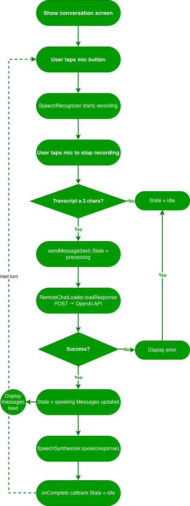
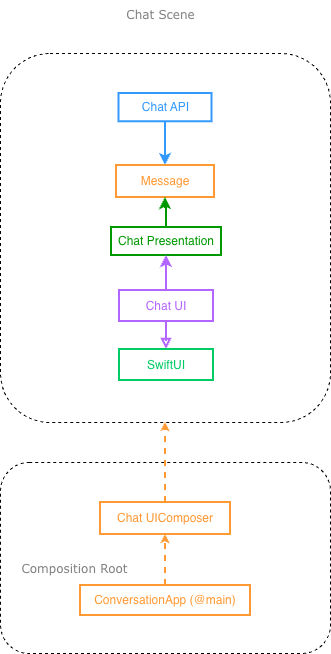

# Conversational AI Mobile App Case Study

This project explores how to build a native iOS conversational assistant with a clean, testable architecture. The app captures spoken input, transcribes it on-device with Apple speech frameworks, sends conversation context to OpenAI, and speaks the assistant response back to the user.

The implementation follows the same spirit as `essential-feed-case-study`: describe the product behavior as specs first, isolate details behind protocol boundaries, and keep the UI driven by presentation models instead of service logic.

## Feature Specs

### Story: User starts a voice conversation

### Narrative #1

```text
As a user
I want to speak to the app
So I can have a hands-free conversation with the assistant
```

#### Scenarios (Acceptance Criteria)

```text
Given the user granted speech recognition and microphone access
When the user taps the microphone button
Then the app should start listening
And the app should display the live transcript

Given the app is listening
When the user taps stop
And the transcript contains meaningful text
Then the app should send the transcript as a user message
And the app should show a processing state

Given the app is listening
When the user taps stop
And the transcript is empty or too short
Then the app should not send a message
And the app should return to idle
```

### Story: User sends a typed message

### Narrative #2

```text
As a user
I want to type a message
So I can use the assistant without speaking
```

#### Scenarios (Acceptance Criteria)

```text
Given the user entered text
When the user taps send
Then the app should append the text as a user message
And the app should request a response from the remote AI service
And the app should show a processing state
```

### Story: User receives an assistant response

### Narrative #3

```text
As a user
I want the assistant to answer my message
So I can continue the conversation naturally
```

#### Scenarios (Acceptance Criteria)

```text
Given the remote AI service returns a valid response
When the response is received
Then the app should append the assistant message to the conversation
And the app should transition to speaking
And the response should be spoken aloud

Given speech playback finishes
When the synthesizer completes
Then the app should return to idle
```

### Story: User cancels or resets the conversation

### Narrative #4

```text
As a user
I want to stop an in-flight request or reset the session
So I can recover quickly and start over
```

#### Scenarios (Acceptance Criteria)

```text
Given the app is processing a remote response
When the user taps cancel
Then the pending request should be cancelled
And the app should return to idle

Given the user wants a fresh conversation
When the user taps reset
Then the app should clear all messages
And the app should stop speech playback
And the app should return to idle
```

### Story: User encounters configuration, transport, or device errors

### Narrative #5

```text
As a user
I want failures to be surfaced clearly
So I understand why the conversation could not continue
```

#### Scenarios (Acceptance Criteria)

```text
Given the app has no API key configured
When the user sends a message
Then the app should fail with a configuration error

Given the device has no connectivity
When the user sends a message
Then the app should fail with a connectivity error

Given the server returns invalid or unexpected data
When the response is mapped
Then the app should fail with an invalid data error

Given the app cannot access a valid recording input
When the user starts recording
Then the app should fail with a microphone availability error
```

## Use Cases

### Start Speech Recognition Use Case

#### Primary course
1. Execute "Start Recording" command.
2. System cancels any in-flight AI request.
3. System stops any active speech playback.
4. System activates the audio session for recording.
5. System starts speech recognition.
6. System delivers listening state.
7. System delivers live transcript updates.

#### Recording error course
1. System delivers an error.

---

### Stop Speech Recognition And Submit Transcript Use Case

#### Primary course
1. Execute "Stop Recording" command.
2. System stops speech recognition.
3. System reads the current transcript.
4. System validates the transcript is not empty.
5. System appends a user message.
6. System requests a remote assistant response.
7. System delivers processing state.

#### Empty transcript course
1. System does not send a message.
2. System delivers idle state.

---

### Load Chat Response From Remote Use Case

#### Data
- Conversation messages

#### Primary course
1. Execute "Load Chat Response" command with the conversation messages.
2. System validates API configuration.
3. System builds the OpenAI chat completions request.
4. System performs the HTTP request.
5. System validates the HTTP response.
6. System maps the JSON payload into assistant text.
7. System delivers the assistant response.

#### Invalid request course
1. System delivers invalid data error.

#### No connectivity course
1. System delivers connectivity error.

#### Invalid response course
1. System delivers invalid data error.

#### API error response course
1. System delivers the API error returned by the server.

#### Cancel course
1. System does not deliver response nor error.

---

### Speak Assistant Response Use Case

#### Data
- Assistant response text

#### Primary course
1. Execute "Speak Response" command with the assistant text.
2. System activates the audio session for playback.
3. System starts speech synthesis.
4. System delivers speaking state.
5. System notifies completion when playback ends.
6. System delivers idle state.

---

### Cancel Pending Request Use Case

#### Primary course
1. Execute "Cancel Pending Request" command.
2. System cancels the in-flight async task.
3. System does not deliver a stale response.
4. System delivers idle state.

---

### Reset Conversation Use Case

#### Primary course
1. Execute "Reset Conversation" command.
2. System cancels the in-flight request.
3. System stops speech playback.
4. System clears all messages.
5. System clears the live transcript.
6. System delivers idle state.

---

### Request Speech Permissions Use Case

#### Primary course
1. Execute "Request Permissions" command.
2. System requests speech recognition authorization from iOS.

## Flowcharts



## Architecture

The project is split so business rules and request orchestration can be tested without SwiftUI or concrete platform services. The app target acts as the composition root, while the reusable feature module defines protocols, request mapping, and presentation flow.

### Architecture Overview



### Module Responsibilities

| Module | Responsibility |
|---|---|
| `ConversationApp` | Composition root, secret loading, iOS speech services, audio session management |
| `ConversationUI` | SwiftUI rendering of chat history, controls, status, and transcript |
| `Conversation` | Feature policies, request orchestration, presenter logic, API mapping, shared abstractions |

### Layer Responsibilities

| Layer | Main Types | Responsibility |
|---|---|---|
| Composition | `ConversationAppApp`, `ConversationUIComposer` | Wire concrete implementations to abstractions |
| UI | `ContentView`, `ChatView`, `ControlsView`, `BubbleView` | Render state and forward user intent |
| Presentation | `ConversationViewModel`, `ConversationPresentationAdapter`, `ConversationPresenter` | Translate intent into use cases and domain events into view state |
| Feature Contracts | `ChatLoader`, `SpeechRecognizing`, `SpeechSynthesizing`, `Message`, `ChatState` | Stable boundaries and shared models |
| API | `RemoteChatLoader`, `ChatEndpoint`, `ChatMapper` | Build requests, call remote service, validate and map responses |
| Infrastructure | `URLSessionHTTPClient`, `SpeechRecognizer`, `SpeechSynthesizer`, `AudioSessionManager` | Concrete platform and network implementation details |

## Request Lifecycle

1. `ContentView` renders a `ConversationViewModel`.
2. User actions such as `startRecording()`, `stopRecording()`, `sendMessage(_:)`, `resetConversation()`, and `cancelPendingRequest()` are forwarded by the view model to its delegate.
3. `ConversationPresentationAdapter` coordinates the concrete use case:
   - starts or stops recording
   - collects transcript updates
   - appends user messages
   - launches the remote chat request
   - triggers speech synthesis
4. `RemoteChatLoader` validates the API key, builds a `ChatEndpoint` request, and executes it through `HTTPClient`.
5. `ChatMapper` validates the HTTP response and extracts assistant text from the JSON payload.
6. `ConversationPresenter` converts domain events into plain display models for state, messages, and transcript.
7. `ConversationViewModel` publishes those updates to SwiftUI.
8. `SpeechSynthesizer` speaks the assistant response and notifies the presenter when playback finishes.

## Error Map

| Failure source | Technical error | Mapped by | Presented as | User-visible effect |
|---|---|---|---|---|
| Missing `OPENAI_API_KEY` | `ChatMapper.Error.apiError(statusCode: 401, message: "Missing OpenAI API key.", type: nil)` | `RemoteChatLoader` | `ChatState.error(error.localizedDescription)` | Status text shows an error while conversation stays intact |
| Request creation failure | `RemoteChatLoader.Error.invalidData` | `RemoteChatLoader` | `ChatState.error(...)` | User sees a generic invalid data error |
| Network or transport failure | `RemoteChatLoader.Error.connectivity` | `RemoteChatLoader` | `ChatState.error(...)` | User sees a connectivity-related error |
| Non-200 API response | `ChatMapper.Error.apiError(statusCode:message:type:)` | `ChatMapper` | `ChatState.error(...)` | User sees the server-side failure propagated through localized error text |
| Malformed success payload | `ChatMapper.Error.invalidData` then `RemoteChatLoader.Error.invalidData` | `ChatMapper` and `RemoteChatLoader` | `ChatState.error(...)` | User sees an invalid data error |
| Invalid recording input, such as simulator without microphone | `RecordingError.invalidAudioFormat` | `SpeechRecognizer` | `ChatState.error(...)` | User sees a microphone availability error |
| Cancelled async request | `Task` cancellation with no delivered result | `ConversationPresentationAdapter` | `ChatState.idle` | No stale assistant message is rendered |
| Empty or too-short transcript | No error, early return | `ConversationPresentationAdapter` | `ChatState.idle` | Nothing is sent, conversation remains unchanged |

### Error Ownership Notes

- Low-level transport errors are normalized in `RemoteChatLoader` so callers only handle stable feature-level failures.
- API response failures preserve server metadata through `ChatMapper.Error.apiError`.
- UI state never mutates directly from network or speech services; everything flows through the presenter.
- Cancellation is modeled as a non-event, which prevents stale responses from being rendered after the user backs out.

## Model Specs

### Message

| Property | Type |
|---|---|
| `id` | `UUID` |
| `role` | `Message.Role` |
| `content` | `String` |
| `timestamp` | `Date` |

### Message.Role

| Case | Meaning |
|---|---|
| `user` | A message authored by the user |
| `assistant` | A message authored by the AI assistant |

### ChatState

| Case | Meaning |
|---|---|
| `idle` | No active recording, processing, or playback |
| `listening` | Speech recognition is active |
| `processing` | A remote response is being requested |
| `speaking` | Assistant response is being spoken aloud |
| `error(String)` | A failure occurred and should be surfaced in the UI |

## Payload Contracts

### Request Contract

```text
POST /v1/chat/completions
Authorization: Bearer <OPENAI_API_KEY>
Content-Type: application/json
```

```json
{
  "model": "gpt-3.5-turbo",
  "messages": [
    {
      "role": "user",
      "content": "Hello"
    }
  ]
}
```

### Success Response Contract Used By `ChatMapper`

```json
{
  "choices": [
    {
      "message": {
        "content": "Hello! How can I help?"
      }
    }
  ]
}
```

### Error Response Contract Used By `ChatMapper`

```json
{
  "error": {
    "message": "Invalid authentication credentials",
    "type": "invalid_request_error"
  }
}
```

## Test Strategy

The test suite already reflects the case-study architecture by verifying behavior at boundary seams instead of relying on UI-level integration alone.

| Test Suite | What It Protects |
|---|---|
| `ChatEndpointTests` | Request URL, headers, method, and JSON body generation |
| `ChatMapperTests` | Mapping of valid responses, malformed payloads, and API error envelopes |
| `RemoteChatLoaderTests` | Request dispatching, connectivity failures, invalid data failures, and missing API key behavior |
| `ConversationViewModelTests` | State transitions from idle to processing to speaking, speaking completion, and no-send behavior for empty transcript |
| `URLSessionHTTPClientTests` | HTTP client transport behavior |

## Run the Project

1. Open the workspace or Xcode project.
2. Copy [ConversationApp/ConversationApp/Secrets.plist.example](/Users/home/Developer/Conversational-AI-Mobile-App/ConversationApp/ConversationApp/Secrets.plist.example) to `ConversationApp/ConversationApp/Secrets.plist`.
3. Add your `OPENAI_API_KEY`.
4. Ensure the app target includes speech recognition and microphone usage descriptions in [ConversationApp/ConversationApp/Info.plist](/Users/home/Developer/Conversational-AI-Mobile-App/ConversationApp/ConversationApp/Info.plist).
5. Build and run on a real device when possible, since simulator microphone behavior can be limited.

## Tradeoffs And Next Steps

- The current implementation uses the Chat Completions endpoint and a fixed model string. A future version could move to streaming or realtime APIs for lower perceived latency.
- Errors currently flow into `localizedDescription`, which is simple and centralized but not yet polished for product-quality copy.
- Cancellation prevents stale UI delivery, but there is no explicit remote cancellation handshake beyond local task cancellation.
- Conversation history is in-memory only. Persistence or resumable sessions could be added later.
- There is no offline cache yet, which keeps the feature lean but leaves the app without a fallback when disconnected.
